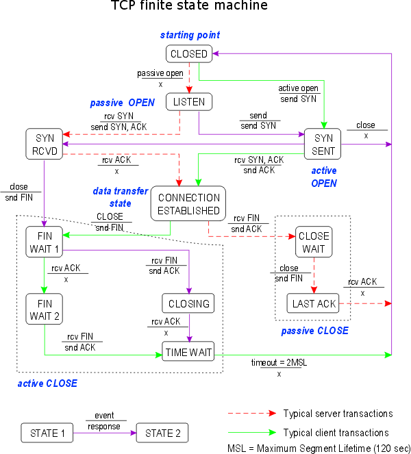

# Tugas 1 Pemrograman Jaringan

## TCP Finite State Machine

  

Diagram finite state mechine dari tcp connection diatas adalah sebuah metodologi perancangan sistem kontrol yang menggambarakan tingkah laku atau prinsip kerja dari Koneksi tcp dengan menerapkan state ( Keadaan ), Event ( Kejadian ) dan action ( Aksi ) .

Pada diagram tersebut keadaan mesin ( State ) diwakili oleh kotak-kotak, transisi dari satu kondisi ke kondisi lain diwakili oleh garis panah, label yang terdapat diatas panah mewakili peristiwa  ( Event ) yang menyebabkan transisi sedangkan label yang terdapat dibawah panah merupakan respon ( Action ) TCP terhadap peristiwa yang terjadi. Label X dibawah panah menandakan tcp tidak merespon terhadapa peristiwa yang terjadi. Garis panah pada diagram tersebut terdapat 3 jenis yaitu panah solid hijau yang menandakan transisi client normal, panah putus-putus merah yang menandakan transisi server normal dan panah solid ungu merupakan transisi yang tidak diharapkan.

State CONNECTION ESTABLISHED adalah tempat terjadinya transfer data. Dua transisi yang mengarah ke State CONNECTION ESTABLISHED menandakan pembukaan koneksi dan dua transisi yang keluar dari State CONNECTION ESTABLISHED menandakan pemutusan koneksi.

## For and If/else
  ### - For
