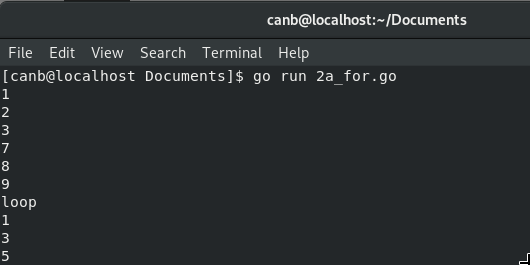
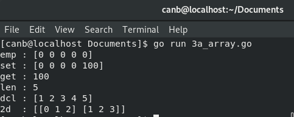

# Tugas 1 Pemrograman Jaringan

## TCP Finite State Machine

  

Diagram finite state mechine dari tcp connection diatas adalah sebuah metodologi perancangan sistem kontrol yang menggambarakan tingkah laku atau prinsip kerja dari Koneksi tcp dengan menerapkan state ( Keadaan ), Event ( Kejadian ) dan action ( Aksi ) .

Pada diagram tersebut keadaan mesin ( State ) diwakili oleh kotak-kotak, transisi dari satu kondisi ke kondisi lain diwakili oleh garis panah, label yang terdapat diatas panah mewakili peristiwa  ( Event ) yang menyebabkan transisi sedangkan label yang terdapat dibawah panah merupakan respon ( Action ) TCP terhadap peristiwa yang terjadi. Label X dibawah panah menandakan tcp tidak merespon terhadapa peristiwa yang terjadi. Garis panah pada diagram tersebut terdapat 3 jenis yaitu panah solid hijau yang menandakan transisi client normal, panah putus-putus merah yang menandakan transisi server normal dan panah solid ungu merupakan transisi yang tidak diharapkan.

State CONNECTION ESTABLISHED adalah tempat terjadinya transfer data. Dua transisi yang mengarah ke State CONNECTION ESTABLISHED menandakan pembukaan koneksi dan dua transisi yang keluar dari State CONNECTION ESTABLISHED menandakan pemutusan koneksi.

## For and If/else
### - For
  
  Code Program :  

  

  Hasil Running :

  

Cara kerja program diatas adalah hasil dari 4 perulangan dengan ketentuan kondisi yang berbeda. Perulangan pertama memiliki hasil 1, 2 dan tiga dengan ketentuan nilai variabel I lebih kecil sama dengan 3. Perulangan kedua memiliki hasil 7, 8 dan 9 dengan ketentuan nilai variabel j lebih kecil sama dengan 9. Perulangan ketiga memiliki hasil kata “loop” dengan ketentuan tidak ada. Perulangan keempat memiliki hasil 1, 3 dan 5 dengan ketentuan nilai variabel n lebih kecil sama dengan 5 serta apabila nilai n memenuhi kondisi n mod 2 sama dengan nol perulangan dilanjutkan apabila tidak tampilkan nilai n.

### - If/Else
   Code Program :  

  

   Hasil Running :

  

Cara kerja program diatas adalah hasil dari 3 kondisi dengan masing ketentuan. Kondisi pertama yaitu apabila 7 mod 2 sama dengan 0 terpenuhi maka tampilkan “7 is even”, apabila tidak terpenuhi maka tampilkan “7 is odd”. Kondisi kedua yaitu apabila 8 mod 4 == 0 terpenuhi maka tampilkan “8 is divisible by 4”, apabila tidak terpenuhi maka tidak terjadi apa-apa. Kondisi ketiga yaitu apabila nilai variabel num lebih kecil dari nol maka tampilkan nilai variabel dan “is negative”, atau apabila nilai variabel num lebih kecil dari 10 tampilkan nilai variabel dan “has 1 digit”, apabila kedua kondisi tadi tidak terpenuhi tampilkan nilai variable n dan “has multiple digits”.

## Array dan Function
### - Array
   Code Program :  

  

   Hasil Running :

  

