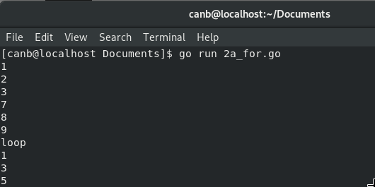
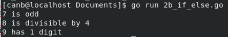
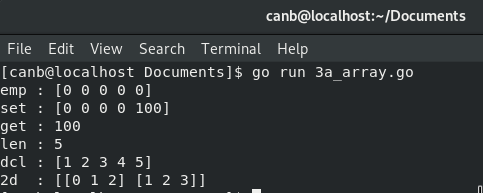
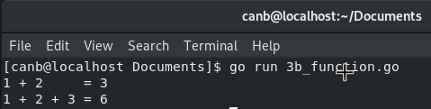
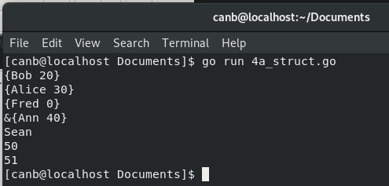
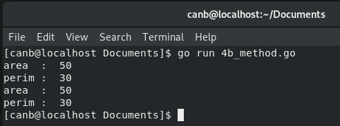
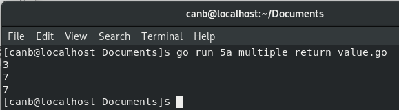
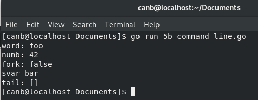
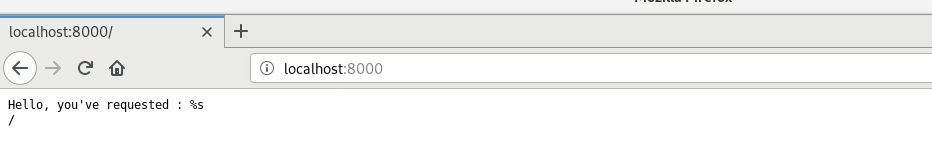

# Tugas 1 Pemrograman Jaringan

### Nama : Chando Anggara Natanael Batubara
### Nim  : 1301154390

## TCP Finite State Machine

  

Diagram finite state mechine dari tcp connection diatas adalah sebuah metodologi perancangan sistem kontrol yang menggambarakan tingkah laku atau prinsip kerja dari Koneksi tcp dengan menerapkan state ( Keadaan ), Event ( Kejadian ) dan action ( Aksi ) .

Pada diagram tersebut keadaan mesin ( State ) diwakili oleh kotak-kotak, transisi dari satu kondisi ke kondisi lain diwakili oleh garis panah, label yang terdapat diatas panah mewakili peristiwa  ( Event ) yang menyebabkan transisi sedangkan label yang terdapat dibawah panah merupakan respon ( Action ) TCP terhadap peristiwa yang terjadi. Label X dibawah panah menandakan tcp tidak merespon terhadapa peristiwa yang terjadi. Garis panah pada diagram tersebut terdapat 3 jenis yaitu panah solid hijau yang menandakan transisi client normal, panah putus-putus merah yang menandakan transisi server normal dan panah solid ungu merupakan transisi yang tidak diharapkan.

State CONNECTION ESTABLISHED adalah tempat terjadinya transfer data. Dua transisi yang mengarah ke State CONNECTION ESTABLISHED menandakan pembukaan koneksi dan dua transisi yang keluar dari State CONNECTION ESTABLISHED menandakan pemutusan koneksi.

## For and If/else
### - For
  
  Code Program :  

  

  Hasil Running :

  

Cara kerja program diatas adalah hasil dari 4 perulangan dengan ketentuan kondisi yang berbeda. Perulangan pertama memiliki hasil 1, 2 dan tiga dengan ketentuan nilai variabel I lebih kecil sama dengan 3. Perulangan kedua memiliki hasil 7, 8 dan 9 dengan ketentuan nilai variabel j lebih kecil sama dengan 9. Perulangan ketiga memiliki hasil kata “loop” dengan ketentuan tidak ada. Perulangan keempat memiliki hasil 1, 3 dan 5 dengan ketentuan nilai variabel n lebih kecil sama dengan 5 serta apabila nilai n memenuhi kondisi n mod 2 sama dengan nol perulangan dilanjutkan apabila tidak tampilkan nilai n.

### - If/Else
   Code Program :  

  

   Hasil Running :

  

Cara kerja program diatas adalah hasil dari 3 kondisi dengan masing ketentuan. Kondisi pertama yaitu apabila 7 mod 2 sama dengan 0 terpenuhi maka tampilkan “7 is even”, apabila tidak terpenuhi maka tampilkan “7 is odd”. Kondisi kedua yaitu apabila 8 mod 4 == 0 terpenuhi maka tampilkan “8 is divisible by 4”, apabila tidak terpenuhi maka tidak terjadi apa-apa. Kondisi ketiga yaitu apabila nilai variabel num lebih kecil dari nol maka tampilkan nilai variabel dan “is negative”, atau apabila nilai variabel num lebih kecil dari 10 tampilkan nilai variabel dan “has 1 digit”, apabila kedua kondisi tadi tidak terpenuhi tampilkan nilai variable n dan “has multiple digits”.

## Array dan Function
### - Array
   Code Program :  

  

   Hasil Running :

  

Cara kerja dari hasil program diatas adalah hasil dari 5 variabel dengan nilai yang berbeda. Anggota emp dihasil kan dari variabel a yang diset dengan array berjumlah 5 dengan anggota angka 0 sebanyak 5. Anggota Set diperoleh dari hasil nilai variabel a yang mana merupakan array berjumlah 5 dengan anggota ber indeks empat di set dengan angka 100. anggota get di peroleh dari hasil nilai anggota array berindeks 4 yaitu 100. Anggota dcl diperoleh dari variabel b yang diset array berjumlah 5 dengan anggota 1, 2, 3, 4, 5. dan yang terakhir anggota 2d diperoleh dari array twoD dengan baris 2 kolom 3 atau 2 dimensi.

### - Function
   Code Program :  

  

   Hasil Running :

  

Cara kerja dari hasil program diatas adalah sebuah  program penjumlahan sederhana menggunakan 2 buah fungsi penjumlahan yang berbeda. Hasil 1 + 2 = 3 diperoleh dengan menggunakan fungsi dengan penjumlahan 2 variabel yang mana 2 variabel tersebut adalah 1 dan 2, sedangkan hasil 1 + 2 + 3 = 6 diperoleh dengan menggunakan fungsi dengan tiga penjumlahan 3 variabel yaitu 1, 2 dan 3.

## Struct dan Method
### - Struct
Code Program :  

  

   Hasil Running :

  

Cara kerja dari hasil program diatas adalah dengan memanfaat type data person yang mana memiliki atribut nama dan umur, sehingga pada saat ingin ditampilkan ataupun di masukkan kedalam sebuah variabel perlu dipanggil type datanya saja dan disikan atributnya sesuai dengan kebutuhan kita.

### - Method
Code Program :  

  

   Hasil Running :

  

Cara kerja dari hasil program diatas adalah dengan menggunakan 2 method berbeda yang mana proses pengolahan datanya berbeda pula. Method dipanggil beserta type data yang sudah di inisiasikan setelah itu data atau nilai yang ada di oleh kemudian di kembalikan nilainya.

## Multiple return value dan Command line
### - Multiple return value
Code Program :  

  

   Hasil Running :

  

Cara kerja dari hasil program diatas adalah memasukkan fungsi yang mengembalikan nilai 3 dan 7 kedalam sebuah variabel kemudian menampilkan hasil dari variabel tersebut.

### - Command line
Code Program :  

  

   Hasil Running :

  

Cara kerja dari hasil program diatas adalah menggunakan library flag yang mana fungsinya untuk parameterize eksekusi program dengan penulisan dalam bentuk key-value (penjelasan lebih jelasnya ada di Link : https://dasarpemrogramangolang.novalagung.com/45-command-line-args-flag.html ).

## Simple Web Application
Code Program :  

  

   Hasil Running :

  

Cara kerja dari hasil program diatas adalah aplikasi web di routing menggunakan fungsi http.HandleFunc(). Hal ini dilakukan agar ketika url dari aplikasi di web bisa diakses dan menampilakan “Hello, you’ve requested : %s\n”. Setelah aplikasi web di routing kemudian server dijalankan dengan menggunakan fungsi http.listenAndServe().
