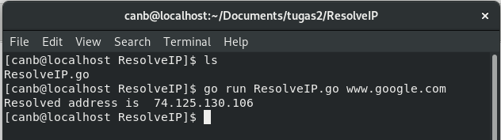
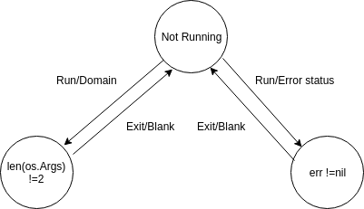
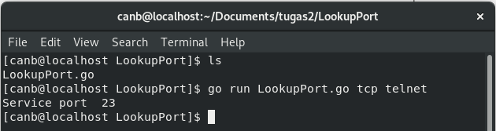
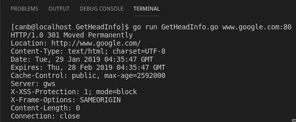
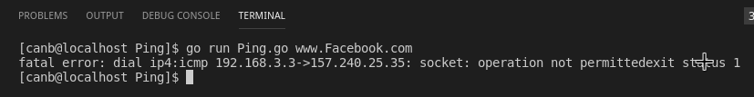

# Tugas-2-Pemrograman-Jaringan-Genap-2018/2019
Tugas 2 Pemrograman Jaringan (CSH4V3)

## Host Lookup ( ResolveIPAddr )

Code Program :

  

Hasil Running :

  

Finite State Machine :

  
 

 
## Service Lookup ( LookupPort )

Code Program :

  

Hasil Running :

  

Finite State Machine :

  
 

 
## TCP Client ( GetHeadInfo )

Code Program :

  

Hasil Running :

  

Finite State Machine :

  
 

 
 ## Raw Sockets and the IPConn Type ( Ping )

Code Program :

  

  

  

  

  

Hasil Running :

  

Finite State Machine :

  "On progress"
 

 
## Multi-Threaded Server

Code Program :

  

Hasil Running :

  "On Progress"

Deskripsi :

  "On Progress"
 

 
## Multi-Threaded Server 2

Hasil Running :

  "On Progress"

Deskripsi :

  "On Progress"
 

