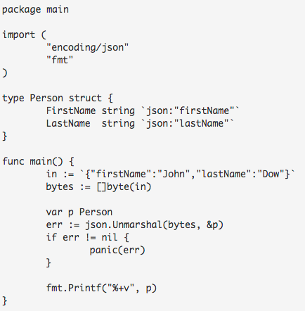

# Tugas 4 Pemrograman Jaringan (Kelompok)
### Anggota :
### - Alvien Ihsan Ramadhan &emsp; &emsp;&emsp;&emsp;&emsp; (1301150088)
### - Chando Anggara Natanael Batubara    (1301154390)
### - Chindy Amalia &emsp; &emsp;  &emsp;&emsp;  &emsp;&emsp; &emsp;&emsp;        (1301164301)
  

## JSON (Javascript Object Notation)

JSON atau Javascript Object Notation adalah notasi standar yang umum digunakan untuk komunikasi data via web. JSON merupakan subset dari javascript. ( sumber:https://dasarpemrogramangolang.novalagung.com/50-json.html )

### JSON MARSHAL

  Code Program :  

  

  Hasil Running :

  

Analisis :

Terdapat Struct Person dengan dua tipe bentukan String yaitu FirstName dan LastName, pada main terdapat variabel bytes dan err yang diisi dengan data hasil pemanggilan fungsi json marshal. Kemudian masuk ke sebuah kondisi yang mana jika inputan err tidak sama dengan nill maka akan muncul panic (err) dan jika inputan ada maka akan mengotputkan bytes yang berisi inputan firstname dan last name yang ada pada struct person. 

Dapat disimpulkan bahwa cara kerja dari program diatas adalah merubah sebuah data struct yaitu person kedalam bentuk JSON dengan menggunakan fungsi Marshal.

### JSON UNMARSHAL
  
  Code Program :  

  

  Hasil Running :

  

Analisis :

Terdapat type Person  struct : hasil decode nantinya akan disimpan ke variabel objek cetakan struct Person. Lalu terdapat variabel in yang disi dengan data string, yang selanjutnya di casting ke tipe []byte karena fungsi unmarshal hanya menerima data bertipe []byte. Selanjutnya ada variabel penampung hasil decode harus di- pass dalam bentuk pointer pada program ini yaitu “ p “. Variabel err diinputkan data hasil fungsi json.unmarshal yang mana parameternya variable bytes dan pointer &p. Proses selanjutanya masuk kesebuah kondisi yang mana jika isi variable err tidak ada inputan makan akan mengoutputkan (panic err) dan jika ada inputan maka akan mengoutputkan (%+v, p).  
  
Dapat disimpulkan bahwa cara kerja dari program diatas adalah membuat  data json string kedalam struct yaitu person dengan menggunakan fungsi UnMarshal.

### Flatbuffer dan Protocol Buffer
Contoh program gRPC Flatbuffer bisa di download pada repository github berikut : 
https://github.com/jonog/grpc-flatbuffers-example 

Screenshoot output contoh program gRPC Flatbuffer :
  - Client
   

  

  
  - Server
   

  

Finite State Machine gRPC :

  

Analisis :

Perbedaan antara Protocol buffer dan Flat buffer adalah Protocol buffer perlu melakukan serialisasi data, sedangkan Flat Buffer tidak perlu melakukan deserialisasi seluruh data pada bagian terakhir sebelum mengakses objek. Hal tersebut juga menimbulkan penggunaan memory pada Flat buffer jauh lebih sedikit daripada Protocol buffer.
  
Sumber : https://codeburst.io/json-vs-protocol-buffers-vs-flatbuffers-a4247f8bda6f , https://google.github.io/flatbuffers/

 

