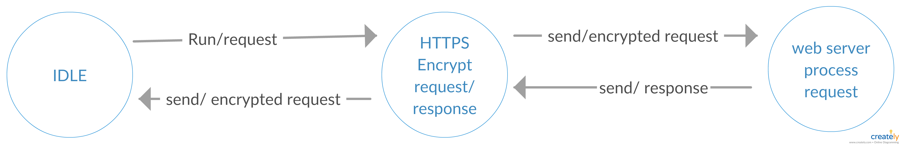

# Tugas 6 Pemrograman Jaringan (Kelompok)
### Anggota :
### - Alvien Ihsan Ramadhan&emsp;&emsp;&emsp;&emsp;&emsp;&emsp;&nbsp;(1301150088)
### - Chando Anggara Natanael Batubara&nbsp;(1301154390)
### - Chindy Amalia&emsp;&emsp;&emsp;&emsp;&emsp;&emsp;&emsp;&emsp;&emsp;&emsp;&nbsp;&nbsp;(1301164301)
  

## Secure Web Server Design

Finite State Machine Secure Web Server Design :

  

cara kerja :

Sesuai dengan FSM diatas cara kerja dari Secure Web Server Design yang kami rancang secara umum sebagai berikut :

cara kerja Secure Web Server Design hampir mirip dengan web server sebelumnya hanya saja perbedaannya proses transaksi terenkripsi oleh protokol HTTPS.

## Web Server Implementation

  "on progress"

